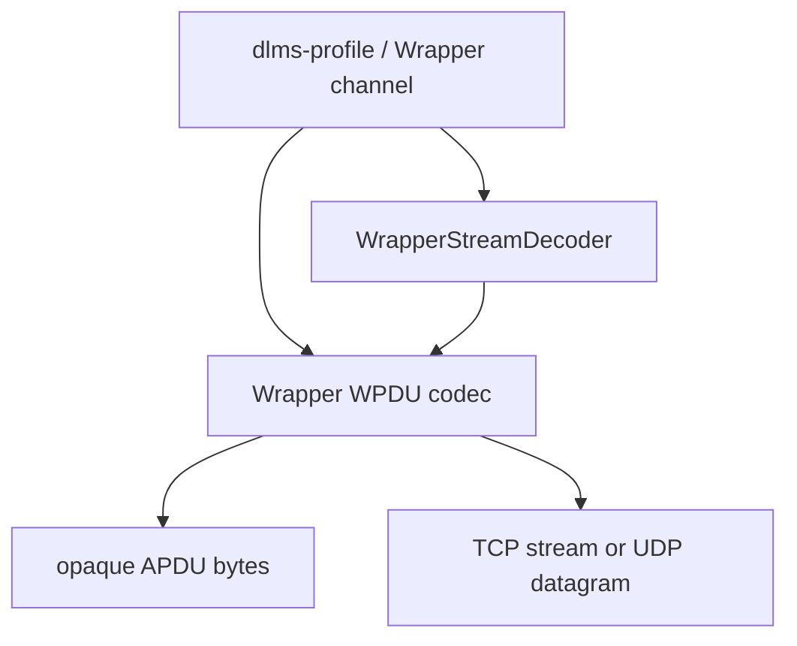
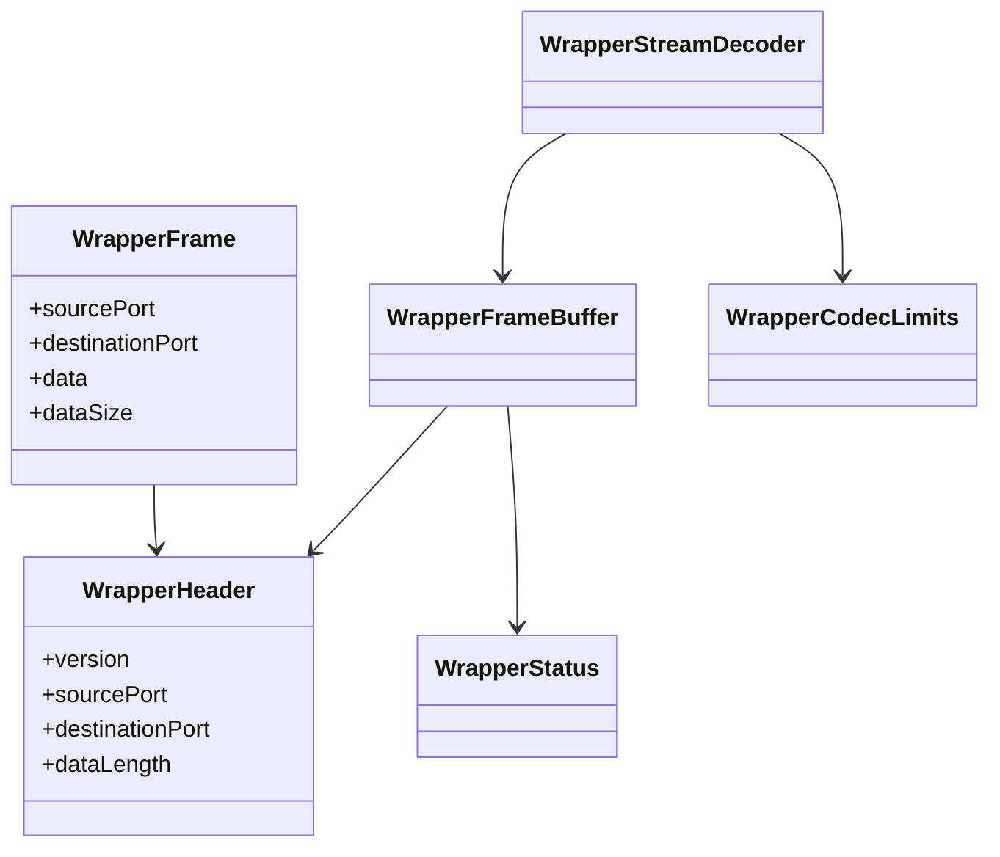
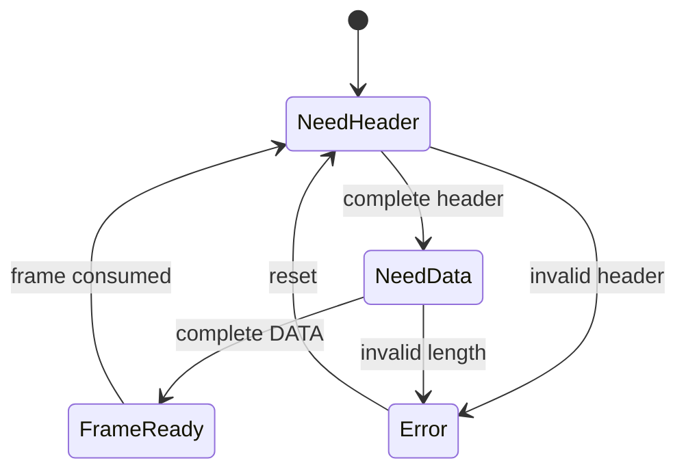

# Wrapper Architecture

## 1. Scope

`dlms-wrapper` implements the DLMS/COSEM Wrapper WPDU codec for TCP/UDP/IP
communication profiles.

The Wrapper `DATA` field is treated as opaque APDU bytes. TCP/UDP sockets,
transport lifecycle, association state, APDU parsing, and security are outside
this repository.

## 2. In Scope

- WPDU header encode/decode.
- WPDU encode/decode.
- Wrapper port constants and validation helpers.
- TCP stream decoder based on Wrapper data length.
- C ABI wrapper.

## 3. Out of Scope

- TCP sockets.
- UDP sockets.
- HDLC or LLC parsing.
- ACSE/xDLMS APDU parsing.
- Application Association state.
- Security and ciphering.

## 4. Dependencies

```text
dlms-wrapper
  -> C++ standard library
```

`dlms-wrapper` must not depend on `dlms-transport`, `dlms-profile`,
`dlms-apdu`, `dlms-hdlc`, or `dlms-llc`.

## 5. Layer Diagram



## 6. Class Interaction Diagram



## 7. State Machine

The codec is stateless. `WrapperStreamDecoder` keeps buffered TCP bytes until a
complete WPDU is available.



## 8. Error Model

Public runtime APIs return `WrapperStatus`. Truncated TCP input returns
`NeedMoreData`; malformed complete input returns a specific invalid or
unsupported status.

## 9. Test Strategy

Unit tests cover header encode/decode, WPDU encode/decode, stream chunking,
multiple WPDUs, invalid lengths, port constants, C ABI, and C header
compilation. Root integration tests verify APDU-shaped payload preservation.
